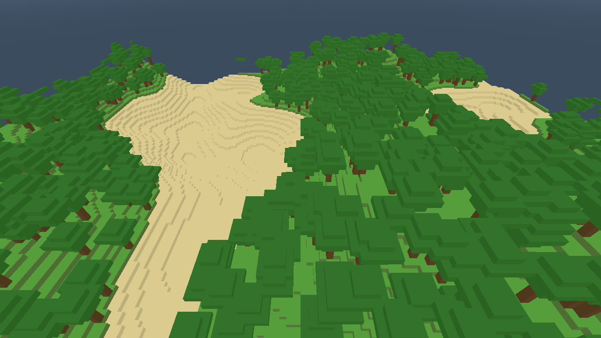

# Regress

A Minecraft-like voxel sandbox in C# on **Godot 4.7 (.NET)**, architected as an **ECS**
([Friflo.Engine.ECS](https://github.com/friflo/Friflo.Engine.ECS)).

Chunks are **16 × 16 × 16 cubes** with **no vertical limit** — build up or dig down forever.
Terrain spans negative Y, with a bedrock floor and a heightmap surface.



## Requirements

- [Godot 4.7 .NET](https://godotengine.org/download) (`scoop install godot-mono`)
- .NET SDK 8.0 or newer (`dotnet --list-sdks`)

## Run

```bash
dotnet build                                   # build the C# assembly
godot-mono --path .                            # play
godot-mono --headless --path . -- --selftest   # 48 headless assertions
godot-mono --path . -- --demo                  # scripted walk + build + mine-down test
godot-mono --path . -- --bench                 # performance run with per-system breakdown
godot-mono --path . -- --shot=out.png          # render one frame to a PNG and quit
```

## Controls

| Input | Action |
| --- | --- |
| `WASD` | move |
| `Space` | jump (fly up when flying) |
| `Shift` | sprint (fly faster when flying) |
| `Ctrl` | fly down |
| `F` | toggle fly |
| `G` | toggle creative (instant break) |
| Mouse | look |
| LMB | hold to mine (duration depends on the block) |
| RMB | place block |
| `1`–`7` | select block: stone, dirt, grass, sand, wood, plank, leaves |
| `R` | respawn on the surface |
| `Esc` | release the mouse |

## Project layout

```
scenes/Main.tscn         entry scene (one Node3D with Game.cs)
src/ChunkComponents.cs   ECS components and tags for a chunk
src/ChunkMesher.cs       16^3 voxels -> ArrayMesh (one quad per air-facing face)
src/Blocks.cs            block palette, per-face colours, break times
src/EditRequests.cs      edit requests + block behaviours (what a break actually removes)
src/TerrainGenerator.cs  noise heightmap, per-column surface range, trees (one per world)
src/VoxelWorld.cs        ECS store + streaming / mesh / collision systems + block access
src/PlayerSystems.cs     player components and the input / look / move / mine / build systems
src/Player.cs            Godot side of the player: body, camera, input callbacks
src/Game.cs              bootstrap, HUD, sky/fog, test-mode entry points
src/SelfTest.cs          headless assertions
src/Bench.cs             performance run
src/Prof.cs              per-system frame accumulators used by --bench
docs/                    architecture, performance, roadmap
```

## Design in one screen

**Entities** are chunks (~230 resident) and the player. A chunk's **archetype is its lifecycle
state**, so "what work is pending" is a memory-layout fact instead of a flag to check:

```
 [Coord, Blocks, Visual] + NeedsMesh ──► + NeedsCollision ──► complete
        ▲                                        │
        └──── SetBlock edit: +KeepAlive ◄────────┘
```

**Systems** are explicit ordered calls with millisecond budgets — query the archetype, spend a
budget, apply structural changes after collecting:

| | mesh | collision | streaming |
| --- | --- | --- | --- |
| query | `AllTags(NeedsMesh)` | `AllTags(NeedsCollision)` | reads the focus |
| budget | 3 ms | 3 ms | 4 chunks/frame |

**Gameplay never mutates the world.** Mining and building *request* edits; the world resolves
them, and `BlockBehaviors` decides that one break is not one block (felling a tree takes the
trunk and its canopy). Break time comes from `Blocks.HardnessOf`.

The deeper reasoning — what is decoupled and what deliberately is not, the tag-versus-field rule,
and the known weaknesses — is in **[docs/architecture.md](docs/architecture.md)**.

## Documentation

| document | contents |
| --- | --- |
| [docs/architecture.md](docs/architecture.md) | ECS inventory, decoupling rules, archetype state machine, block edit pipeline, deliberate couplings, known weaknesses |
| [docs/performance.md](docs/performance.md) | how to measure, the numbers, the engine-floor caveat, the two knobs that bound frame time |
| [docs/roadmap.md](docs/roadmap.md) | unlimited dimensions, tools and drops, why per-world parallel tick is the wrong axis |
| [docs/texture-packs.md](docs/texture-packs.md) | texture pack format: twelve tile keys, `pack.json`, path-traversal rules, discovery rungs, failure matrix, non-goals |

## Performance in one paragraph

Steady state costs **0.03 ms/frame** in game systems; almost all of the ~1.4 ms frame is Godot's
main loop and buffer present, which `--bench --frozen` demonstrates by running the same frame
with no game code at all. That floor drifts ±30% with GPU thermal state, so frame times are only
comparable within one session. The real cost is chunk streaming (0.61 ms mesh + 0.32 ms collision
per chunk), bounded by time budgets rather than chunk counts. Details and numbers in
[docs/performance.md](docs/performance.md).

## Test modes

| flag | what it does |
| --- | --- |
| `--selftest` | 48 headless assertions: terrain, mesher cross-checked against brute force, triangle winding, vertical-world invariants, break/place request pipeline, tree felling, per-world terrain |
| `--demo` | drives the player without a keyboard: walk, place, then mine straight down 63 blocks to bedrock, asserting they stay on solid ground |
| `--bench` | five-phase performance run; `--frozen` measures the engine floor, `--view=` / `--collision=` / `--budget=` sweep |
| `--shot=path.png` | render N frames, save a PNG, quit |
| `--freecam`, `--map` | high oblique / orthographic top-down debug cameras |
| `--nosky`, `--nofog` | magenta background / no fog, for telling "missing geometry" apart from "background" |
| `--diag` | spawn diagnostics |

## Gotchas worth knowing

- **Godot renders clockwise triangles.** Counter-clockwise quads are invisible, and the world
  still looks "almost right" through the resulting backface gaps. `SelfTest` asserts the winding
  of every triangle.
- **Vertex colours set from code are linear.** Authored sRGB values need `SrgbToLinear()`.
- **A `CharacterBody3D` with no `CollisionShape3D` silently falls through the world**, and one
  that ends up inside solid geometry can never depenetrate itself.
- **An empty mesh does not mean "nothing there".** A fully buried chunk has no visible faces but
  still has to stop a player digging into it — it gets a `BoxShape3D` instead of a trimesh.
- **In Friflo, phrase tags as pending work.** `WithoutAllTags(A, B)` means "missing *at least
  one*", so a "has collision" tag used as a negation re-matched chunks that already had collision
  and rebuilt their trimesh every frame. `AllTags(NeedsCollision)` is unambiguous.
- **`Node3D.Rotation` is derived from the basis**, so comparing against it is not bit-exact and
  an "only write when changed" guard will never fire. Cache what you last applied.

## License

GPL-3.0 — see [LICENSE](LICENSE).
